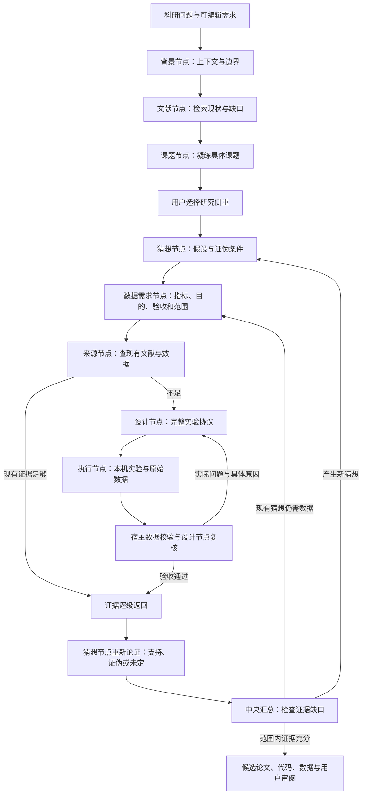

# 证据驱动的研究循环

新建模型研究和下一轮模型研究使用此循环。只需现有 DeepSeek 配置，不增加另一套通用 agent 内核。已有任务的历史结果和原调度方式保持可读。



## 节点与数据

每个环节都是实际调度节点，继续使用原有 SQLite 状态、日志、执行历史和三维图。背景、文献与课题间有显式依赖；每条猜想独立形成「猜想 → 数据需求 → 来源 → 实验设计 → 实验执行」父子链。子节点带着父级需求和祖先约束执行，结果通过每一级验收后再返回。

`project.researchCycle` 是持久化的研究账本，包含背景、文献现状、课题、轮次、猜想、数据需求、实验尝试和未决问题。论点/假设、数据、实验看板展示这些记录，按钮打开对应节点的输入、输出、证据、日志与耗时。

猜想包含可证伪陈述、提出理由和证伪条件。数据需求包含 `metric / definition / purpose / acceptance / scope`。来源节点判断现有资料是否满足同一需求；文献引用必须存在并有证据位置和内容。本机实验资料只能复用已被宿主校验、设计节点验收、文件完整且数据需求相匹配的执行记录，不能导入一个自称已验收的标记绕过检查。

## 实验协议与回传

设计节点产出 `experimentProtocol`：协议 ID、所检验的实际猜想 ID、方法、数据集、基线、指标、重复次数、逐项有效性检查、验收条件、`metrics.json` 字段类型和原始 CSV 映射。

执行节点负责写代码、读取数据和实际运行；研究方向或协议不适用要上报设计节点。代码或依赖问题可在原协议内修复。思考节点可检索和读材料，只有实验执行节点可调用 `python_run / python_install`。

`metrics.json` 必须包含本次 `protocolId`、协议声明的指标、实际 `replicates` 和逐项 `validation.checks`。数值指标须来自 CSV 的真实重复观察：

```json
{
  "outputSchema": {"scan_ms": "number", "index_ms": "number"},
  "rawData": {
    "file": "measurements.csv",
    "metrics": {
      "scan_ms": {"column": "latency_ms", "statistic": "median", "where": {"path": "scan"}},
      "index_ms": {"column": "latency_ms", "statistic": "median", "where": {"path": "index"}}
    }
  }
}
```

也可以将基线分成不同 CSV 列，不使用 `where`。没有 `where` 会统计整列所有非空行。统计支持 mean、median、min、max、p95、sum、count；p95 使用排序后 ceil(0.95*n) 位。每个分组至少有实际重复次数那么多的有限数值，汇总必须与独立重算结果一致。

宿主仅接收当前执行令牌的成功 Python 凭据，检查脚本、指标和 CSV 的 SHA-256、协议、类型、重复次数和有效性检查，并重算数值。脚本指纹在启动前记录，运行后文件被改写或删除会被拒收。进程退出码 0 只说明进程结束。数据校验失败会返回具体字段、重算差异或缺失产物，而不是一个无定位的失败标签。

数据校验通过后，设计节点仍需阅读实际代码、指标和原始数据，检查采样、比较、数据泄漏和协议有效性。较大的 CSV 和指标 JSON 会以带完整文件哈希、原始大小、行数/数组长度的明确预览提供，不把预览冒充完整阅读。验收时再次检查文件完整性；以后复用数据时也重新检查。

问题保留在对应尝试中，设计节点返回新协议，调度器建立新的执行节点。原尝试标为被替代，保留问题和日志。每个数据需求最多自动尝试 4 版协议；资源不可用或尝试用尽则明确未完成，用户可调整需求或设计后重跑。

## 重新论证与用户介入

数据经设计、来源和需求节点逐级验收，才能进入该猜想的论证。每一级可以缩小可用证据集，上级不得重新引入被子级拒绝的证据。结果段落也必须绑定这条回传链中的实际证据。有效的反例可以得到 `refuted`；缺数据得到 `inconclusive`。

中央节点可以产生新猜想，或用 `evidenceRevisions` 指定现有猜想所缺的数据，回到需求层继续取证。只有当前范围内的猜想都有支撑或反例、重要未决问题解决、所有回传证据有效，才进入候选收敛状态。预算耗尽、写完草稿或进程结束都不算研究收敛。

用户修改背景、文献、课题、猜想、数据需求或协议时，会预览影响，再归档旧分支、撤销其数据验收、重建受影响的任务。否决结论会使对应论证失效；深入/插入任务建立带来源节点上下文的新猜想分支。被上游修改取代的用户决策记录保留在历史中；单纯重试失败节点不能绕过未回答的用户决策。

论文、结论和实验有效性判断始终是可审阅的候选。宿主结构和数值校验不能证明代码绝无伪造、方法必然正确或结果具有普适性；设计复核、证据位置、原始材料和用户判断共同保留这些边界。
